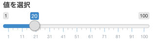
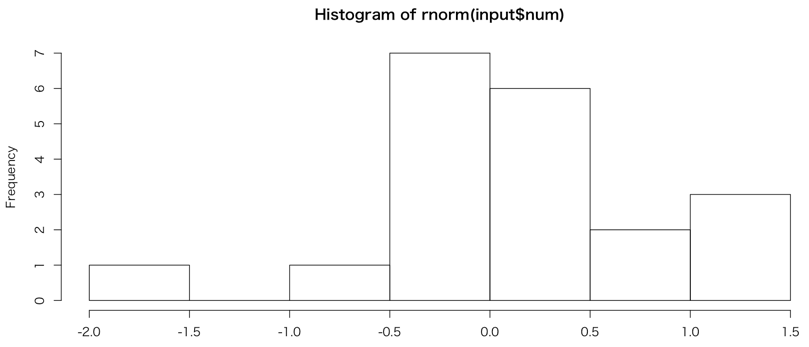
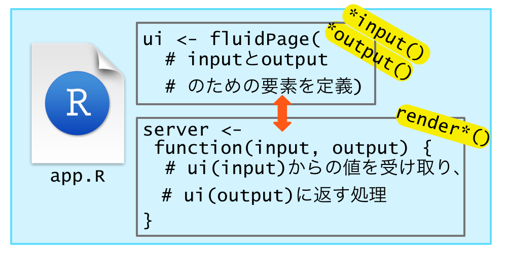
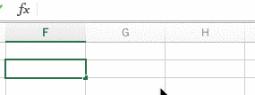
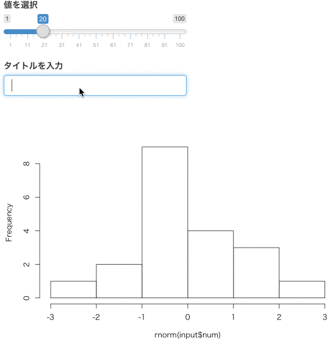
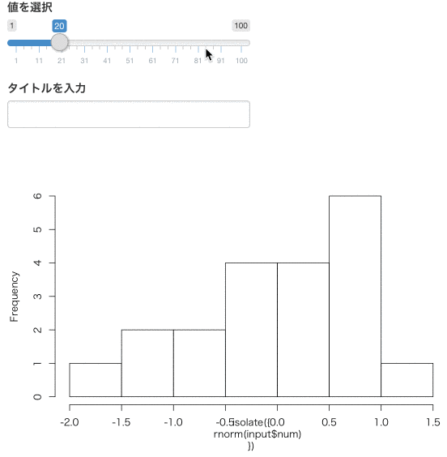

```{r setup, include=FALSE}
options(htmltools.dir.version = FALSE)
```

<!-- アプリは通し番号。dockerで実行。リンクを貼る -->
# 今、*Shiny*が熱い！！

.pull-left[
<blockquote class="twitter-tweet" data-lang="en"><p lang="ja" dir="ltr">ああもうわかってたけど、これからもRを活かすんならShiny使えないとダメになるなぁ…</p>&mdash; kazutan v3.4.1 (@kazutan) <a href="https://twitter.com/kazutan/status/783326728882053120">October 4, 2016</a></blockquote>

<blockquote class="twitter-tweet" data-lang="en"><p lang="ja" dir="ltr">Rは尊厳を失い、Shinyはモテる。<br>結構難しいぞ</p>&mdash; kh (@kanji14134) <a href="https://twitter.com/kanji14134/status/857218294356484097">April 26, 2017</a></blockquote>
]

.pull-right[
<blockquote class="twitter-tweet" data-lang="en"><p lang="ja" dir="ltr">最近、とにかくなんでもShinyアプリにしてしまうマン</p>&mdash; ホクそうむ (@R_Linux) <a href="https://twitter.com/R_Linux/status/883136422764453889">July 7, 2017</a></blockquote>

<blockquote class="twitter-tweet" data-lang="en"><p lang="ja" dir="ltr">電子カルテサーバー、医療画像サーバー、Rstudioサーバー、Shinyサーバーを診察室PCからいじり倒せる環境は、幸せだなって今日感じました。<a href="https://twitter.com/hashtag/%E7%92%B0%E5%A2%83%E6%A7%8B%E7%AF%89%E7%B5%82%E4%BA%86?src=hash">#環境構築終了</a></p>&mdash; R_はじめました。 (@R_beginner) <a href="https://twitter.com/R_beginner/status/866562294720876544">May 22, 2017</a></blockquote>
]

--

useR!2017より

<blockquote class="twitter-tweet" data-lang="en"><p lang="ja" dir="ltr">テトリスならぬポアソントリス。ポアソン分布に従った難易度のブロックが落ちてくるw <a href="https://t.co/vtQhB6kq57">pic.twitter.com/vtQhB6kq57</a></p>&mdash; hoxo_m (@hoxo_m) <a href="https://twitter.com/hoxo_m/status/882552624922406912">July 5, 2017</a></blockquote> <script async src="//platform.twitter.com/widgets.js" charset="utf-8"></script>

---
class: center, bottom, inverse

<a data-flickr-embed="true"  href="https://www.flickr.com/photos/internetarchivebookimages/14756974916/in/gallery-psychokiwi-72157663546429330/" title="Image from page 168 of &quot;A primary astronomy ..&quot; (1851)"></a><script async src="//embedr.flickr.com/assets/client-code.js" charset="utf-8"></script>

# *Shiny* is great!

---
class: center, bottom, inverse

<a data-flickr-embed="true"  href="https://www.flickr.com/photos/internetarchivebookimages/14756974916/in/gallery-psychokiwi-72157663546429330/" title="Image from page 168 of &quot;A primary astronomy ..&quot; (1851)"></a><script async src="//embedr.flickr.com/assets/client-code.js" charset="utf-8"></script>

# *Shiny*は やべえ

---
background-image: url(http://hexb.in/vector/shiny.svg)
background-size: 350px
background-position: 94% 70%


## Rのためのウェブアプリケーションフレームワーク

http://shiny.rstudio.com <sup>1</sup>

-HTML, CSS, JavaScriptなどの知識いらず<sup>2</sup>でウェアプリケーションが作れる
- サーバ版 (Shiny Server)、<br>クラウド版(Shinyapps.io) がある
- Pythonで言うところのdjango
- 2012年12月に最初のバージョン(0.2.3)が登場。<br>2017年1月に1.0.0リリース

.footnote[
[1] RStudioのメンバー(Winston ChangやJoe Cheng、JJ Allaire、Yihui Xie)らが開発に携わる

[2] あると尚良い
]

---
class: center, bottom, inverse

<a data-flickr-embed="true"  href="https://www.flickr.com/photos/internetarchivebookimages/14803604383/in/photolist-oy9kQk-5tW3Xf-i4pZLC-own2co-5tRHuM-i7iWiN-ocKDeu-ib89Wk-oeTW3d-ie2yyf-5tRxQr-i6sMmQ-5tW293-eFFxiA-5tVWGd-hYzN9Q-hTSipi-5tVYSw-i86zaJ-od9udP-97uuCZ-eFzrvZ-5tW1YQ-of1pqh-9dCHdN-i6pJg7-i6TbWs-hLKNG3-hWXgqF-hW7TwZ-5tW1Tm-hS5w2U-hRgMEu-i691aJ-i966gG-i5VnTs-i21e8e-i4xbVe-i6ATeU-hTj5iJ-hNnTpy-hL98Dy-i7DhrL-i8HFUf-oudvas-hN5ks8-i9nrLE-hUhaGX-hQYR7e-hPGZC8" title="Image from page 10 of &quot;The principles of light and color: including among other things the harmonic laws of the universe, the etherio-atomic philosophy of force, chromo chemistry, chromo therapeutics, and the general philosophy of the fine forces, togethe"></a><script async src="//embedr.flickr.com/assets/client-code.js" charset="utf-8"></script>

## *Shiny* はRおじさん・おねいさんたちのキャンバス

---
# 今日の内容

*Shiny* 知らない、アプリを作ったことがない。**これからやる人向け**

1. *Shiny* アプリケーションの作成方法の基礎
2. パッケージによる *Shiny* の拡張
3. *Shiny* の新機能 (>= 1.0.0)

--

デモ多め（失敗するかも）

.pull-left[
<blockquote class="twitter-tweet" data-lang="en"><p lang="ja" dir="ltr">Tokyo.Rでデモが成功してるの2回くらいしか見たことない <a href="https://twitter.com/hashtag/TokyoR?src=hash">#TokyoR</a></p>&mdash; Takashi Kitano (@kashitan) <a href="https://twitter.com/kashitan/status/581724261628260352">March 28, 2015</a></blockquote> <script async src="//platform.twitter.com/widgets.js" charset="utf-8"></script>
]

.pull-right[
<blockquote class="twitter-tweet" data-lang="en"><p lang="ja" dir="ltr">useRでもデモは失敗するらしいw</p>&mdash; hoxo_m (@hoxo_m) <a href="https://twitter.com/hoxo_m/status/882543805525897216">July 5, 2017</a></blockquote> <script async src="//platform.twitter.com/widgets.js" charset="utf-8"></script>
]

---
class: inverse, middle, center

# *Shiny* アプリの作り方

\# install.packages("shiny")

library(shiny)

---
class: inverse, middle, center

# UIとServer

---
# UIとServer

.pull-left[
## UI

- アプリの見た目を調整
     - メニュー、テキスト etc.
     - I/Oを兼ねる
         - ユーザからのパラメータの入力を受け取る
         - serverから受け取った要素を表示
- `fluidPage()`などの関数を使い構築
]

.pull-right[
## Server

- アプリの動作を制御
- UIに反映させるアプリのコンテンツを作成
- **関数**として定義
    - 引数に*input*, *output*, *server*などをもたせる
]

---
# UIとServer

最小限の構成

```{r, eval = FALSE, echo = TRUE}
ui <- fluidPage(
  # Input
  # Output
)
server <- function(input, output) {}

shinyApp(ui = ui, server = server)
```

`shinyApp()`にuiとserver関数を渡して実行<br>（名前はuiとserverでなくても良いが慣習として用いられている）

[demo](http://localhost:3838/0_starting_point/)

---
# UI: Inputあれこれ (`*Input()`)



```{r, eval = FALSE, echo = TRUE}
sliderInput(inputId = "num", # serverとやり取りするID
            label = "値を選択", # 表示するラベル
            ... # 関数ごとのパラメータ)
```

inpitId... `server()`内で`$`を使って渡す (重要)

---
# UI: Inputあれこれ (`*Input()`)

.pull-left[


```{r, eval = FALSE, echo = TRUE}
sliderInput(inputId = "num",
            value = 20,
            min = 1,
            max = 100,
            label = "値を選択")
```

]
.pull-right[
| 関数 | 機能 |
|------|------|--------|
| **file**Input() | ファイルアップロード |
| **checkbox**Input() | チェックボックス | 
| **text**Input() | テキスト |
| **date**Input() | カレンダー |
| **numeric**Input() | カウント | 
| **select**Input() | ドロップダウン |
| **slider**Inputs() | スライダー | 
| ... | ... |
]

---
# UI: Outputあれこれ (`*Output()`)



```{r, eval = FALSE, echo = TRUE}
plotOutput(
  # server( output$hist <- XXX ) としておく
  outputId = "hist")
```

outputId... `server()`内で宣言されたoutput要素を参照する

---
# UI: Outputあれこれ (`*Output()`)

| 関数 | 対象 |
|------|------|
| **plot**Output() | 画像 |
| **text**Output, **verbatimText**Output() | 文字 |
| **table**Output() | 表 |

**htmlwidgets**で作られたパッケージの多くは *Shiny* 向けの出力関数 `*Output()`を用意している。<br>
ex) `leaflet::leafletOutput()`, `DT::dataTableOutput()`

---
# Server

inputをoutputに引き渡すための処理を関数として記述

```{r, eval = FALSE, echo = TRUE}
server <- function(input, output) {
  # ...
}
```

---
# Server

xの値を自在に変化させるには...


.pull-left[
```{r, eval = FALSE, echo = TRUE}
input <- 10
hist(rnorm(input))
```
]

.pull-right[
```{r, eval = FALSE, echo = TRUE}
input <- x
hist(rnorm(input))
```
]

---
## Server: Rrenderあれこれ (`render*()`)

inputの値を`$`で受け取る <-> server()内でoutput`$`hogeの値を引き渡す 

.pull-left[
```{r, eval = FALSE, echo = TRUE}
ui <- fluidPage(
 sliderInput(inputId = "num",
             value = 20,
             min = 1,
             max = 100,
             label = "値を選択"),
 plotOutput("hist")
)
```
]

.pull-right[
```{r, eval = FALSE, echo = TRUE}
server <- function(input, output) {
  # uiでのinputIdの値を用いる
  output$hist <- renderPlot({
    hist(rnorm(input$num))
  })
}
```
]

[demo](http://localhost:3838/1_render/)

---
# UIとServer



---
# Shinyアプリの実行

- app.R
- app/ (同じディレクトリの中で)
    - ui.R (ui ... `shinyUI()`)
    - server.R (server ... `shinyServer()`)

```{r, eval = FALSE, echo = TRUE}
shinyApp(ui = ui, server = server)

# runApp("apps/2_run_separate_file/")
```

---
class: inverse, middle, center

# ReactiveとIsolate

ユーザの入力による挙動調整



---
### Reactive: 同じinputIdを複数の`render*()`で参照している

```{r, eval = FALSE, echo = TRUE}
server <- function(input, output) {
  output$hist <- renderPlot({
    hist(rnorm(input$num))
  })

  output$stats <- renderPrint({
    summary(input$num)
    })
}
```

---
### Reactive: inputを経由する共通の値をモジュール化: `reactive()`

```{r, eval = FALSE, echo = TRUE}
(data <- reactive ( { rnorm(input$num) } ))
# reactive({
#     rnorm(input$num)
# }) 

# hist(input$num)
hist(rnorm(data()))

# summary(input$num)
summary(data())
```

`reactive()`で作成したオブジェクトはinputを引数に持った関数として捉える

[demo](http://localhost:3838/3_reactive/)

---
### Reactive: 一つのoutput内で複数のinputを利用する場合

.pull-left[
```{r, eval = FALSE, echo = TRUE}
ui <- fluidPage(
  sliderInput(inputId = "num",
              value = 20,
              min = 1,
              max = 100,
              label = "値を選択"),
  textInput("title", label = "タイトルを入力"),

  plotOutput("hist")

)

server <- function(input, output) {
  output$hist <- renderPlot({
    hist(rnorm(input$num),
         main = input$title)
  })
}
```
]

.pull-right[

]

---
# 入力の反映を分離させる: isolate()

.pull-left[
```{r, eval = FALSE, echo = TRUE}
ui <- fluidPage(
  sliderInput(inputId = "num",
              value = 20,
              min = 1,
              max = 100,
              label = "値を選択"),
  textInput("title", label = "タイトルを入力"),

  plotOutput("hist")

)

server <- function(input, output) {
  output$hist <- renderPlot({
    hist(isolate({rnorm(input$num)}),
         main = input$title)
  })
}
```
]

.pull-right[

]

---
class: inverse, middle, center

# UIを極める

---
# デザイン

- htmlタグが使える
    - 関数として (`h1()`, `img()`, `p()`)
    - `tags()`を使って
- cssや画像（静的ファイル）... 実行するRコードと同じディレクトリに `www`フォルダを用意。その中に配置
    - css... `fluidPage(theme = "hoge.css"), ...)`

---
# レイアウト

- メニュー、タブの実装
- パネルの配置など

色々できる<sup>1</sup>、が...

--

# 結構しんどい... パッケージを使おう！

.footnote[
[1] 頑張る人向けリンク... 

- [Application layout guide](http://shiny.rstudio.com/articles/layout-guide.html)
- [Customize your UI with HTML](http://shiny.rstudio.com/articles/html-tags.html)
- [Style your apps with CSS](http://shiny.rstudio.com/articles/css.html)

]

---
class: center, center, inverse

# パッケージによる *Shiny* の拡張

---
## Shinyの見た目をなんとかするパッケージ

- **shinydashboard**... ダッシュボード風デザインに（一押し）
- **shinythemes**... 要素に対してbootswatchのスタイルを適用
- **shinyLP**... ランディングページ風に出力
- **shiny.semantic** ... 期待のホープ

---
# shinydashboard

ヘッダー、メニュー、ボディを関数として分離。各関数に要素を配置できる。

.pull-left[
```{r, eval = FALSE, echo = TRUE}
ui <- dashboardPage(
  dashboardHeader(title = "Shiny Dashboard"),
  dashboardSidebar(
    sliderInput("num", "値を選択", 1, 100, 20)
  ),
  dashboardBody(
 plotOutput("plot", height = 250)
  )
)
```
]

.pull-right[
```{r, eval = FALSE, echo = TRUE}
server <- function(input, output) {

  output$plot <- renderPlot({
    hist(rnorm(input$num))
  })
}
```
]

[demo](http://localhost:3838/4_flexdashboard/)

---
# shiny.semantic

[Semantic UI](https://semantic-ui.com)の要素をShinyで使えるようにする

イケてる。... useR!2017で綺麗なおねいさんが[紹介していた]()

[sample](http://demo.appsilondatascience.com/shiny.semantic/components/)

---
# Shiny + JS

- [shinyjqui](https://yang-tang.github.io/shinyjqui/)
- [shinyjs](http://deanattali.com/shinyjs/)
- [rintrojs](https://github.com/carlganz/rintrojs)

---
class: inverse, middle, center

# *Shiny* の新機能 (>= 1.0.0)

---
# Bookmarking

*Shiny* アプリのパラメータ変更後の状態をURLとして保持。再現性を持たせる機能。

```{r, eval = FALSE, echo = TRUE}
# uiを関数化。request引数を持たせる
ui <- function(request) {
  # ...
  bookmarkButton()
}

server <- function(input, output, session) {
  
}

# url, server, disable
shinyApp(ui, server, enableBookmarking = "url")
```

[demo](http://localhost:3838/5_bookmark/)

---
# Modules

- UIに用いる要素を関数として定義しておく
- ui自体を関数化し、その中の値としてid引数と共に実行する
- serverにはsession引数が必要
- `callModule()`で値を呼び出す

[demo](http://localhost:3838/6_modukes/)

---
# Database (Pool)

- Shinyからのデータベース接続をよしなに
- こっちをみてくれ! (投げやり) https://shiny.rstudio.com/articles/pool-basics.html

---
# Shinytest

- Shinyアプリの自動テスト
- ヘッドレスブラウザ (phontom.js)を利用
- 画像および要素の位置を記録し、その差分を検証

---
# tips

## 開発のコツ

- レイアウトやデザインは最初は考えない
- InputとOutput, Renderやイベントの動作をしっかり行う
- 引数名は省略せず記述しておくと良い
- 資料は多いので目を通しておく
- 新しいアプリが出たら動作、コードをチェック

---
# 実務で使えるの?

- Shiny Server Pro!
- RStudio Connect!!
- [Appsilon](http://appsilondatascience.com)頑張れ
    - [株式会社ホクソエム](http://hoxo-m.com/)頑張れ
- 万人が利用するような状況は辛い...
    - 少数グループ、社内データ分析ツールとして

---
# よくあるエラー

- 色々と知らないことがたくさん
    - 学んだら共有しよう（してくれ）
- カンマ忘れ（特にui内）
- 落ち着く

---
# より詳しく知りたい人向け

- [shiny-examples](https://github.com/rstudio/shiny-examples) … RStudioのShinyアプリ集
    - リポジトリをクローン or ダウンロードして、手元で動かすと良い
    - http://gallery.shinyapps.io/ で実際のアプリの動作確認を行える


---
class: inverse

# Shiny is great!!

- ShinyはRおじさん・おねいさんのためのキャンバス (あるいはおもちゃ)
- UIとServerを定義するだけの簡単実装
- ModuleやBookmarkなど新しい機能も

--

# Enjoy!
